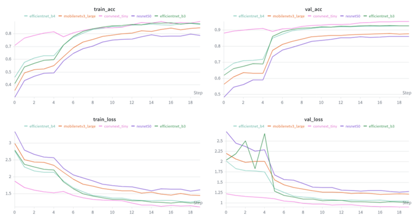
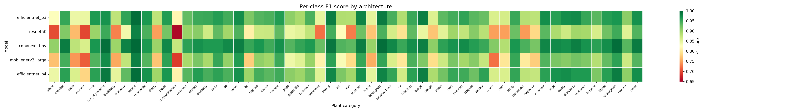
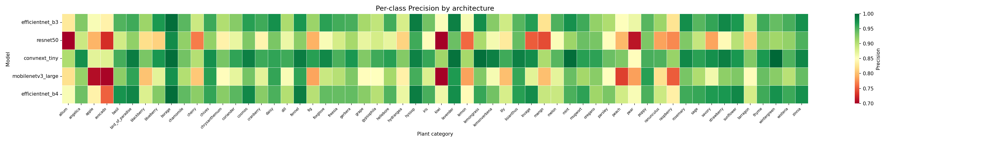

## Monitorage durant la sélection du modèle
 

Comme discuter dans la section "Entrainement du modèle", j'ai entrainé 5 modèles différents (EfficientNet-B3, ResNet-50, DenseNet-121, ConvNeXt-Tiny et MobileNetV3-Large) pour la classification d’images de plantes. Pendant l'entrainement, j'ai suivi les différentes métriques de performance (précision, rappel, F1-score) pour évaluer les performances des différents modèles et prendre la décision de quel modèle sera utilisé pour la prochaine étape de déploiement sur une API. J'ai utilisé Weights & Biases pour suivre les différentes métriques d’entrainement en temps réel, et de comparer facilement les performances des différents modèles pour prendre la décision de quel modèle sera utilisé pour la prochaine étape de déploiement sur une API. Le monitorage durant la sélection du modèle est essentiel pour assurer la qualité du modèle choisi, en permettant de détecter rapidement les problèmes et de prendre des mesures correctives si nécessaire.

  

##### Figure 1: Monitorage des différentes métriques d’entrainement pour les 5 modèles testés (EfficientNet-B3, ResNet-50, DenseNet-121, ConvNeXt-Tiny et MobileNetV3-Large) pour la classification d’images de plantes. Ces graphiques ont été générés avec Weights & Biases, qui m'a permis de suivre les différentes métriques d’entrainement en temps réel, et de comparer facilement les performances des différents modèles pour prendre la décision de quel modèle sera utilisé pour la prochaine étape de déploiement sur une API.

   
## Résultats des modèles (validation)

| Modèle              | Best Val Accuracy |   |Checkpoint                  |
|---------------------|------------------:| -|-----------------------------|
| **convnext_tiny**      | **0.95399**       | | `convnext_tiny_best.pth`      |
| **efficientnet_b3**    | 0.92878           | | `efficientnet_b3_best.pth`    |
| **efficientnet_b4**    | 0.92785           | | `efficientnet_b4_best.pth`    |
| **mobilenetv3_large**  | 0.87913           | | `mobilenetv3_large_best.pth`  |
| **resnet50**           | 0.86224           | | `resnet50_best.pth`           |

À la fin de cet entrainement, nous avons un gagnant clair, qui est le modèle **convnext_tiny**, qui a obtenu les meilleures performances en termes de précision, rappel et F1-score. 

## Métriques des différents modèles

Pour évaluer les performances des différents modèles, j'ai utilisé plusieurs métriques d’évaluation, telles que la précision et le F1-score. Ces métriques m'ont permis de comparer les performances des différents modèles sur les différentes classes qui ont servi pour l'entrainement, et de prendre la décision de quel modèle sera utilisé pour la prochaine étape de déploiement sur une API. 

Pour rappel, la **précision** est la proportion d'images correctement classées parmi les images prédites comme positives, tandis que le **F1-score** est la moyenne harmonique de la précision et du rappel, qui prend en compte à la fois les faux positifs et les faux négatifs. Il est important de bien comprendre le but escompter de notre modèle pour choisir la métrique d’évaluation la plus appropriée. Par exemple, si nous voulons minimiser les faux positifs, la précision serait une métrique plus appropriée, tandis que si nous voulons minimiser les faux négatifs, le rappel serait une métrique plus appropriée. Le F1-score est souvent utilisé comme une métrique d’évaluation globale qui prend en compte à la fois la précision et le rappel.

##### Figure 2 : F1-score et présisions des différents modèles sur toutes les classes. On observe que le modèle ConvNeXt-Tiny a des performances globalement élevées, avec quelques variations entre les classes et catégories. Les autres modèles ont des performances plus variables, avec des points faibles sur certaines classes.

 

### **Conclusion**

En conclusion, le monitorage durant la sélection du modèle est essentiel pour assurer la qualité du modèle choisi, en permettant de détecter rapidement les problèmes et de prendre des mesures correctives si nécessaire. En utilisant des outils de monitorage tels que Weights & Biases, j'ai pu suivre les différentes métriques d’entrainement en temps réel, m'assurer que ces métriques sont bien sauvegardées pour consultation future et de comparer facilement les performances des différents modèles pour prendre la décision de quel modèle sera utilisé pour la prochaine étape de déploiement sur une API. Le modèle ConvNeXt-Tiny a clairement été meilleur pour la classification d’images de plantes, avec des performances élevées en termes de précision et de F1-score.