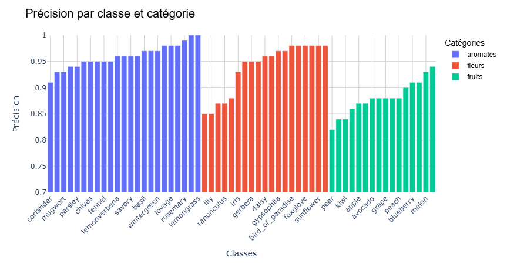
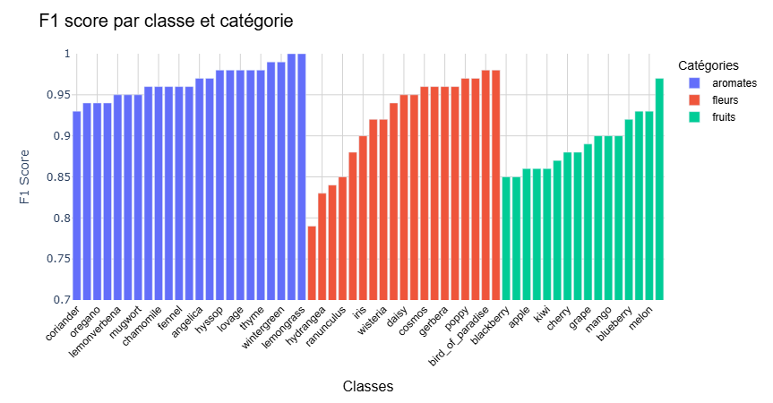
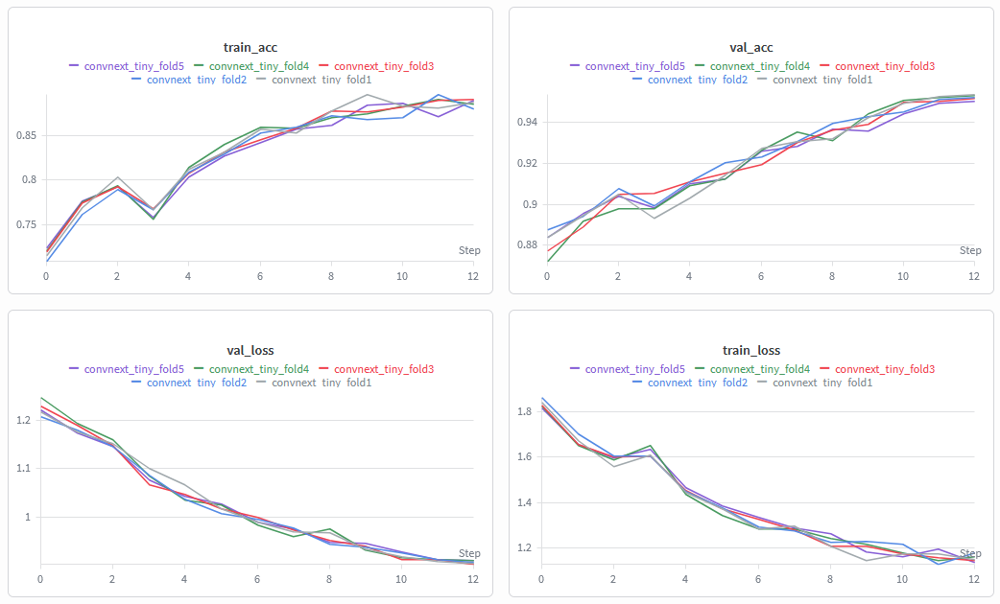
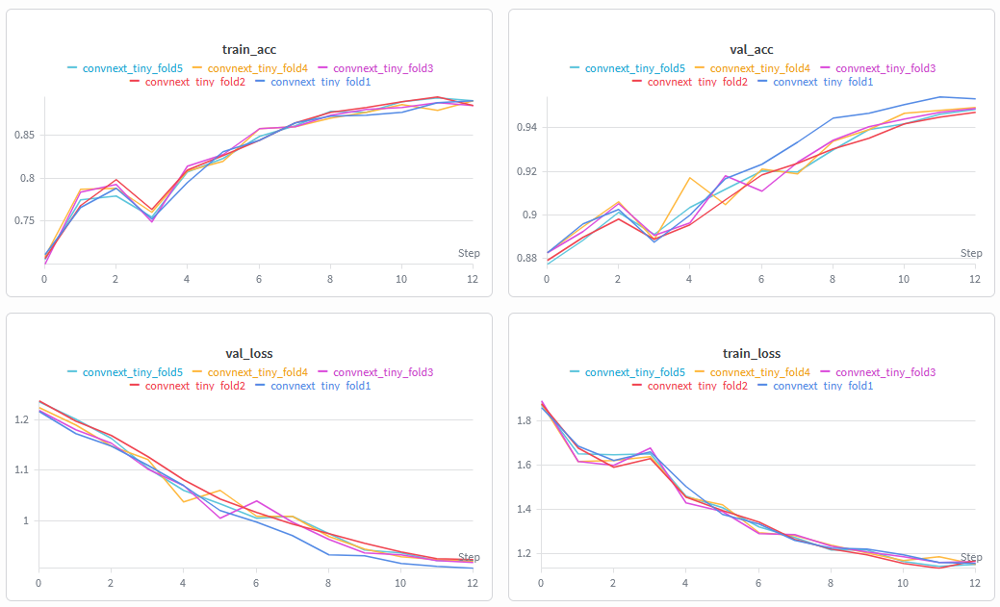

## Objectif de cette étape

Il a été présenté dans la section précédente que le modèle ConvNeXt-Tiny a obtenu les meilleures performances globales en termes de précision et de F1-score. Dans cette section, je vais pousser un peu plus les tests sur ce modèle pour évaluer ses performances de manière plus détaillée. Des tests classiques pour évaluer ce modèle ont été faits et seront plus détaillés dans cette section, qui est dédiée à l'évaluation du modèle de classification de plantes.

### **Analyse en détail des performances du modèle de classification de plantes choisi**

La première étape que j'ai voulu voir est les détails des scores de précision et de F1-score pour chaque classe et catégories. Ceci va me permettre de voir si le modèle avait des performances plus faibles pour certaines classes, ce qui pourrait indiquer des problèmes spécifiques à ces classes. Ces tests ont été effectués à partir du jeu de données de validation, qui a été séparé du jeu de données d'entrainement (80% des données initiales). Voici donc pour ce modélè, les détails des scores de précision et de F1-score pour chaque classe : 

 

##### Figure 1 : Precision des modèles par classe et parcatégorie. On observe que les modèles ont des performances globalement élevées, avec quelques variations entre les classes et catégories.

 

##### Figure 2 : F1-score des modèles par classe et par catégorie. On observe que les modèles ont des performances globalement élevées, avec quelques variations entre les classes et catégories.

Globalement, on observe que les performances du modèle ConvNeXt-Tiny sont élevées pour la plupart des classes (>80% de précision pour toutes les classes). Il est intéressant de noter que certaines classes ont des performances légèrement plus faibles que d'autres, ce qui pourrait indiquer des problèmes spécifiques à ces classes. Cette baisse de performance pour certaines classes pourrait être due à plusieurs facteurs, tels que la qualité des images, la complexité de la classe (le fait que cette classe soit plus similaire à une autre), ou encore l'imbalance des classes dans le dataset (par example, il y avait beaucoup moins d'image de kiwi, ce qui pourrait expliquer le fait que les performances soient plus faibles). 

Il pourrait être intéressant de faire une analyse plus approfondie pour comprendre les raisons de ces variations de performance entre les classes, et éventuellement trouver des moyens d'améliorer les performances pour ces classes spécifiques. Cependant, dans l'ensemble, le modèle ConvNeXt-Tiny a obtenu des performances élevées pour la classification d’images de plantes, ce qui est un bon indicateur de sa capacité à généraliser à de nouvelles données.

### **Tests de performance du modèle sélectionné**

Pour s'assurer qu'il n'y a pas eu de surapprentissage durant la phase initiale d'entrainement, il est possible de faire une analyse de type K-fold stratified cross-validation. Cette technique d’évaluation de la performance d’un modèle de machine learning consiste à diviser le dataset en K sous-ensembles (ou "folds") de manière stratifiée, c’est-à-dire en respectant la distribution des classes dans chaque fold. Le modèle est ensuite entrainé K fois, chaque fois en utilisant K-1 folds pour l’entrainement et le fold restant pour le test. Les performances du modèle (accuracy) est ensuite déterminée pour chaque fold, la différence entre ces K folds indique si le modèle est robuste.

##### Figure 3 : Résultats de la K-fold stratified cross-validation.

Il est possible de voir que les 5 K-fold d'entrainement du modèle ConvNeXt-Tiny ont obtenu des performances élevées, avec une précision moyenne de 94.6% et une faible variance entre les folds (écart-type de 0.004). Cela indique que le modèle est robuste et qu'il n'y a pas eu de surapprentissage durant la phase initiale d'entrainement. En utilisant K-fold stratified cross-validation, j'ai pu évaluer les performances du modèle sélectionné de manière plus fiable, en prenant en compte la variabilité des données et en fournissant une évaluation plus robuste de la performance du modèle sur des données non vues. 

### **Division du dataset en train/validation/test**

Une approche complémentaire pour évaluer les performances du modèle de classification de plantes sélectionné est de faire une division du dataset en train/validation/test plus classique, avec un split de 70% pour l'entrainement, 15% pour la validation et 15% pour le test. Cette approche permet d'obtenir une estimation plus fiable de la performance du modèle sur des données non vues, en réduisant le risque de surapprentissage (overfitting) et en fournissant une évaluation plus robuste de la performance du modèle sur des données jamais vues durant l'entrainement. En utilisant cette approche, j'ai pu vérifier que les résultats obtenus avec la K-fold stratified cross-validation sont similaires à ceux obtenus avec un split plus classique du dataset, ce qui confirme la robustesse des résultats et la performance du modèle sélectionné pour la classification d’images de plantes.

##### Figure 4 : Résultats de la K-fold stratified cross-validation avec un split plus classique du dataset (70% train, 15% validation, 15% test).

### **Run Summary (detailed)**

| Metric                     | Score     | Interpretation |
|----------------------------|-----------|----------------|
| **Test Accuracy**          | **0.94627** | Très haute précision globale |
| **F1‑Score Macro**         | 0.94478   | Bon équilibre entre classes |
| **Precision Macro**        | 0.94521   | Peu de faux positifs |
| **Recall Macro**           | 0.94480   | Peu de faux négatifs |
| **Val–Test Gap**           | 0.00945   | Excellente généralisation |

### **Conclusion**

Tous ces tests de performance ont permis de confirmer que le modèle ConvNeXt-Tiny sélectionné pour la classification d’images de plantes est robuste et performant, avec une précision élevée et une bonne capacité à généraliser à de nouvelles données. En utilisant différentes techniques d’évaluation, telles que la K-fold stratified cross-validation et un split plus classique du dataset, j'ai pu obtenir une évaluation plus fiable de la performance du modèle sur des données non vues, ce qui est crucial pour garantir que le modèle sera efficace lorsqu'il sera déployé sur une API pour être utilisé par tous et chacun pour identifier les différentes classes de plantes à partir de leurs images.