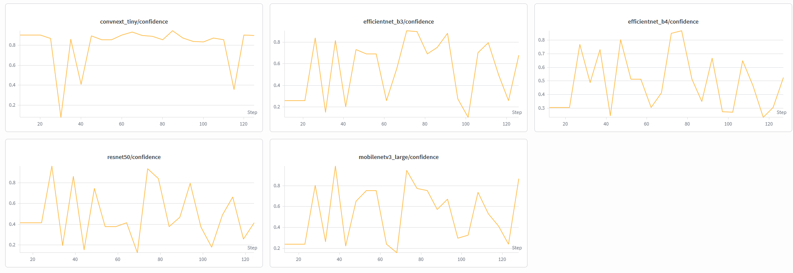
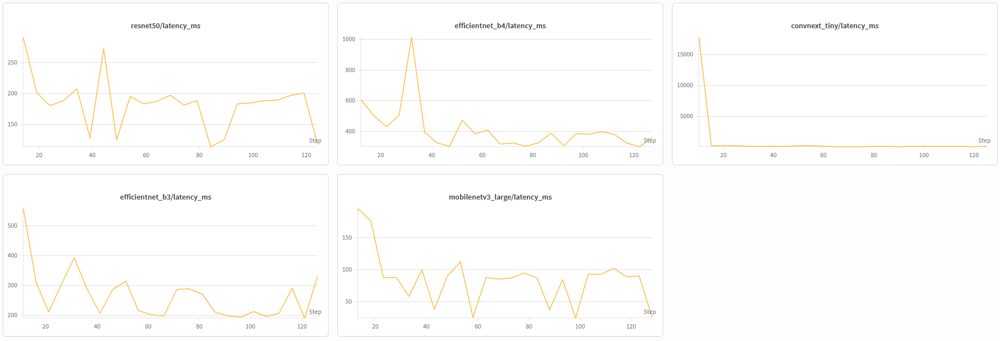

## Objectif de cette étape

Une fois que le modèle de classification de plantes a été sélectionné et évalué pour ses performances, il est important de continuer à monitorer ses performances une fois qu'il est déployé en production. Le monitorage en production permet de s'assurer que le modèle continue à offrir des performances élevées et à généraliser à de nouvelles données, même après son déploiement sur une API pour être utilisé par tous et chacun pour identifier les différentes classes de plantes à partir de leurs images. Dans cette section, je vais présenter les différentes techniques de monitorage que j'ai mises en place pour suivre les performances du modèle en production, ainsi que les résultats obtenus grâce à ce monitorage.

### **Monitoring des performances du modèle en production**

De la même façon qu'il est possible de monitorer les performances du modèle durant la phase d'entrainement, il est aussi possible de monitorer les performances du modèle une fois qu'il est déployé en production. Pour cela, j'ai mis en place différentes techniques de monitorage pour suivre les performances du modèle en production (surout au niveau de la latence, et de la précision et confience des différentes predictions). Ces techniques de monitorage permettent de détecter rapidement tout changement dans les performances du modèle en production, et de prendre des mesures pour corriger ces changements si nécessaire. Par exemple, si le modèle commence à avoir des performances plus faibles pour certaines classes, cela pourrait indiquer un problème spécifique à ces classes, et il serait alors possible de faire une analyse plus approfondie pour comprendre les raisons de ces changements de performance, et éventuellement trouver des moyens d'améliorer les performances pour ces classes spécifiques.

À plusieurs endroits de l'API, j'ai mis en place des techniques de monitorage pour suivre les performances du modèle en production. Par exemple, j'ai mis en place un système de logging pour suivre les différentes prédictions faites par le modèle, ainsi que les différentes métriques de performance (surtout au niveau de la précision et de la confiance) pour chaque classe. J'ai aussi mis en place un système de monitoring pour suivre la latence des différentes prédictions faites par le modèle, afin de s'assurer que le modèle continue à offrir des performances élevées en termes de temps de réponse. Toutes ces données sont enregistrées en temps réel sur l'application Weight and Biases, ce qui me permet de suivre les performances du modèle en production en temps réel.

   

##### Figure 1 : Exemple de monitoring des performances du modèle en production, avec un suivi de la confiance pour chaque modèle.

##### Figure 2 : Exemple de monitoring de la latence des différentes prédictions faites par les modèles en production.

### **Conclusion**

Il n'a pas été vraiment possible pour cette certification de faire un monitorage en production sur une longue période de temps, mais les différentes techniques de monitorage que j'ai mises en place permettent de suivre les performances du modèle en production en temps réel, et de détecter rapidement tout changement dans les performances du modèle. En utilisant ces techniques de monitorage, je suis confiant que le modèle de classification de plantes sélectionné pourra continuer à offrir des performances élevées et à généraliser à de nouvelles données, même après son déploiement sur une API pour être utilisé par tous et chacun pour identifier les différentes classes de plantes à partir de leurs images.