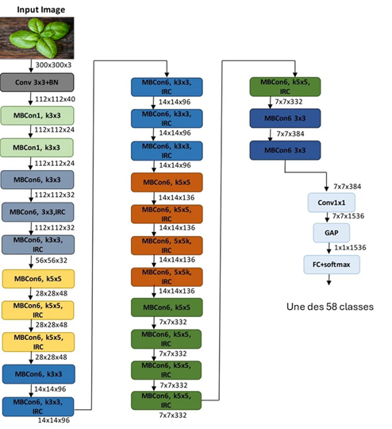

# 🧩 **Filtrage automatique des images qui serviront à l'entraînement des modèles (Data-Centric AI)**

## **Objectif**

L’objectif de cette étape a été de compléter le dataset initial qui contenait déjà plus de 27 000 images réparties sur 23 classes d'aromates. Pour sélectionner ces nouvelles images d'espèce de plantes différentes, j'ai d'abord téléchargé du site iNaturalist.com 500 images dans 19 classes de fleurs et 18 classes d'arbres fruitiers. À l'aide de l'outil de sélection que j'avais developpé pour la première partie du projet, j'ai ensuite sélectionné manuellement les images les plus pertinentes pour chaque classe, en me basant sur des critères tels que la qualité de l'image, la visibilité de la plante et la diversité des angles de prise de vue. J'ai ainsi sélectionné environ 8000 images supplémentaires pour ces nouvelles classes.

---

## **Problème rencontré**

Ce premier passage a permis de collecter un grand nombre d'images supplémentaires pour enrichir le dataset mais le snombre d'images par classe était trop faible pour l'entrainement d'un bon modèle de reconnaissance. L’objectif a donc été d’améliorer la qualité du dataset avant l’entraînement du modèle final, en automatisant la selection d'images supplémentaires, sans introduire de biais. 

Cette démarche s’inscrit dans une approche **data‑centric**, où l’accent est mis sur la qualité des données plutôt que sur la complexité du modèle.

Le filtrage automatique permet :

- d’éliminer les images hors distribution (angles atypiques, objets parasites, mauvaises plantes, images floues),
- d’homogénéiser les classes,
- de réduire le bruit dans les données,
- d’accélérer la collecte de nouvelles images,
- d’éviter les biais liés au self‑training.

Un filtrage manuel aurait été trop long. Il était donc nécessaire de mettre en place ce **pipeline automatique** capable d’évaluer la pertinence de chaque image, mais sans introduire de biais.

---

## **Approche retenue**

Pour éviter les biais du self‑training (où le modèle final filtre ses propres données), j’ai adopté une approche en trois étapes :

1. **Extraction d’embeddings** à l’aide d’un modèle pré‑entraîné (EfficientNet‑B3).
2. **Clustering non supervisé** pour modéliser la distribution interne propre à chaque classe.
3. **Classification XGBoost** pour exploiter les embeddings dans un modèle tabulaire.

Cette combinaison permet de filtrer les images selon deux critères complémentaires :

- **distance au cluster le plus proche** (cohérence visuelle),
- **confiance du classifieur XGBoost** (cohérence sémantique mais pas basé sur la classe).

Une image est acceptée si elle est à la fois **visuellement proche** des images de la classe et **cohérente** avec les patterns appris par XGBoost.

## Embeddings

Chaque image est passée dans un modèle EfficientNet‑B3 pré‑entraîné ImageNet. Ce modèle a été choisi pour sa bonne performance sur les tâches de classification d'images, tout en étant relativement léger et rapide à exécuter. Ce modèle correspond à une série de couches convolutionnelles qui extraient des caractéristiques visuelles de l'image à différents niveaux d'abstraction. On récupère la sortie de ce bloc convolutionnel un vecteur de dimension fixe (1536 features dans le cas de EfficientNet-B3).

Ce vecteur représente l’image dans un espace latent où des images similaires sont proches les unes des autres.

**Résultat :**

- un tableau `embeddings` de taille `(8001, 1536)`
- un tableau `labels` de taille `(8001,)`

Ces embeddings ont servi de base pour les étapes suivantes.
