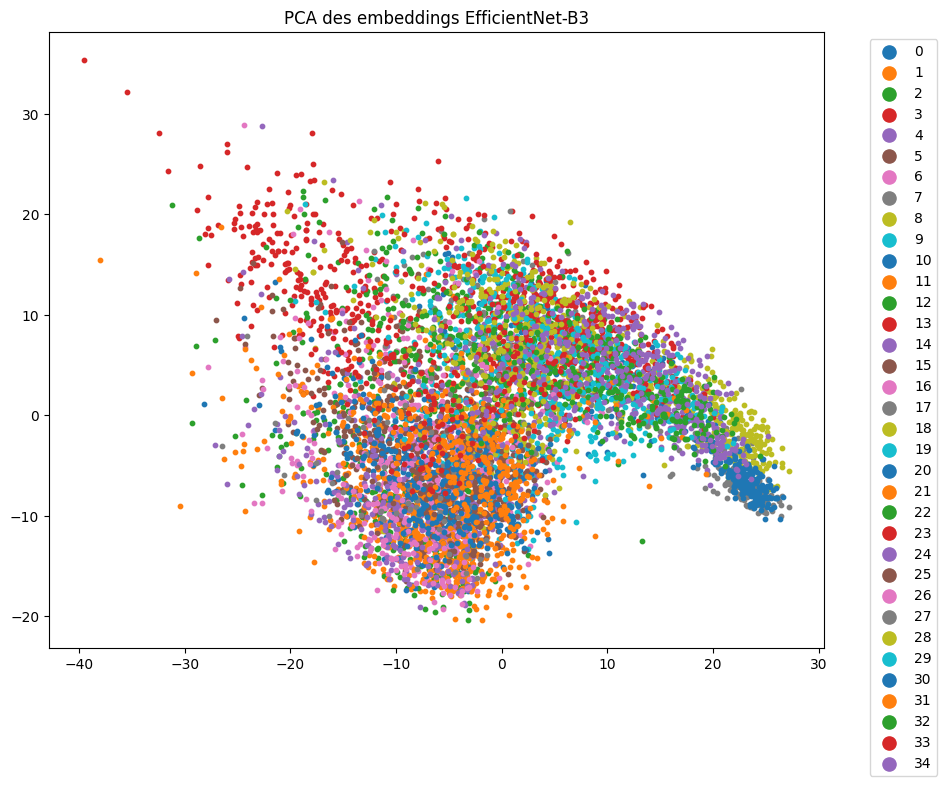

# Étape 2 — Visualisation PCA

Pour valider visuellement la cohérence des clusters, j’ai appliqué une réduction de dimension (PCA) sur l’ensemble des embeddings.

Cela permet :

- de vérifier que les différentes classes sont relativement bien séparées dans l'espace des embeddings,
- d’identifier les classes qui se chevauchent,
- de déterminer si certaines images, même sélectionnées manuellement, semblent être à l'extérieur de la distribution.

 

##### Figure 1 : Visualisation des embeddings avec PCA, colorés par classe. On observe une bonne séparation entre les classes, avec quelques chevauchements.

## **Interprétation**

Cette visualisation confirme que les classes sont relativement bien séparées dans l'espace des embeddings, ce qui valide la pertinence des features extraites par EfficientNet-B3. On observe cependant quelques chevauchements entre certaines classes, ce qui suggère que certaines images sont ambiguës ou que des classes partagent des caractéristiques visuelles similaires. Par manque de temps, une analyse approfondie de ces zones de chevauchement n'a pas été réalisée, mais ces classes visuellement similaires sont reprises dans l'analyse des erreurs du modèle final (matrice de confusion).
