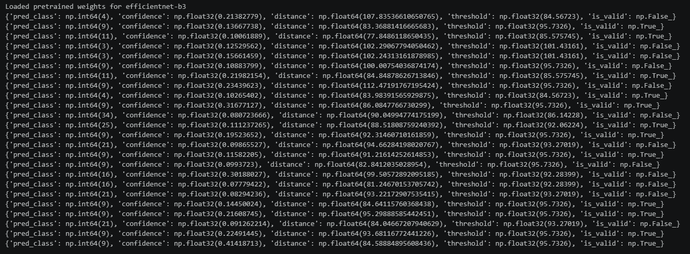
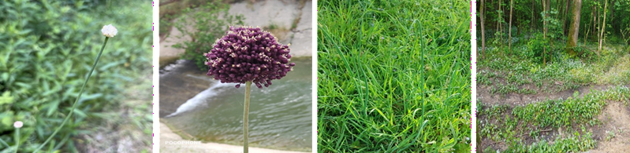
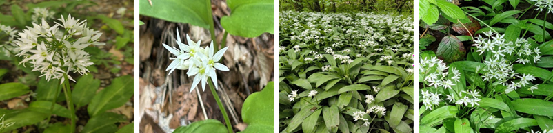
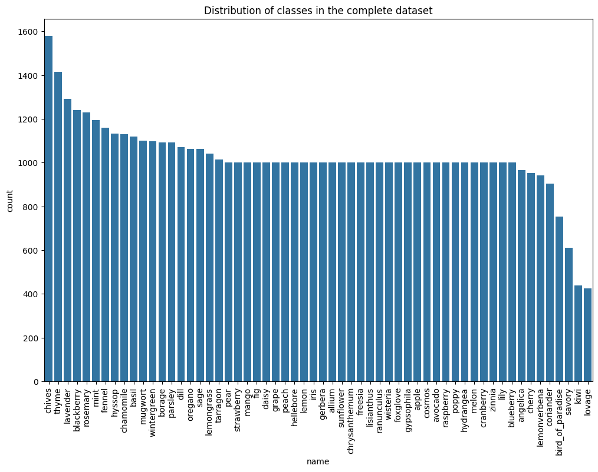

# Étape 5 — Filtrage automatique des nouvelles images

## Objectif

Pour cette étape, j’ai mis en place un pipeline de filtrage automatique pour les nouvelles images collectées, basé sur les clusters KMeans formés précédemment et le modèle XGBoost multi‑classe. L'idée était de s'assurer que les nouvelles images téléchargées étaient cohérentes avec les classes déjà définies, en utilisant à la fois des critères de cohérence visuelle (distance au cluster) et de cohérence sémantique (confiance XGBoost).

### Méthodologie

Pour chacune des classes où je devais télécharger plus d'images pour avoir un meilleur dataset pour entrainer mes modèles, j'ai demandé au site iNaturalist de me fournir une liste supplémentaire d'images. Après avoir extrait les embeddings de ces nouvelles images, j’ai utilisé le modèle XGBoost pour prédire une classe et une confiance, puis j’ai comparé la distance de l’embedding au centroïde de cette classe avec un seuil défini. 

Voici les grandes étapes du pipeline en quelque mots lorsqu’une nouvelle image est collectée :

1. on calcule son embedding via EfficientNet‑B3,
2. on demande à XGBoost de prédire une classe + une confiance,
3. on calcule la distance de l’embedding au centroïde de cette classe,
4. on compare cette distance au seuil défini lors du clustering.

Une image est acceptée si :

- la confiance XGBoost est suffisante,
- **et** la distance au centroïde est inférieure au seuil.

Ce mécanisme permet :

- d’accepter automatiquement les images “typiques”,
- de rejeter les images douteuses,
- d’éviter d’introduire du bruit dans le dataset.

## Pipeline de filtrage automatique

Pour chaque nouvelle image qui était téléchargée, le pipeline de filtrage automatique évaluait sa pertinence en combinant les critères de cohérence visuelle (distance au cluster) et de cohérence sémantique (confiance XGBoost):

1. calcul de l’embedding,
2. prédiction XGBoost,
3. distance au cluster le plus proche,
4. comparaison au seuil de la classe.

Une image était acceptée si :

- la confiance XGBoost est supérieure à un seuil minimal (≈ 0.10),
- la distance au centroïde est inférieure au seuil défini pour la classe.

Cette règle combine **cohérence visuelle** et **cohérence sémantique**.

En appliquant ce filtrage sur les nouvelles images collectées, j’ai pu réduire significativement le nombre d’images incohérentes (ex : mauvaises plantes, angles atypiques) tout en conservant la majorité des images pertinentes. J'ai augmenté le dataset de manière efficace, en enrichissant les classes avec des images de qualité, ce qui a permis d'améliorer les performances du modèle final lors de l'entraînement.

##### Figure 1. Exemple de filtrage automatique : chaque ligne représente les résultats pour une image collectée. Les deux critères de filtrage sont indiqués : la confiance XGBoost (la clé "confiance") et la distance au centroïde (la clé "distance"). Si cette distance est inférieure au seuil défini pour la classe (indiqué par "seuil"), et que la confiance est inférieure à 0,1, alors l'image est acceptée (is_valid = True), sinon elle est rejetée (is_valid = False). 

##### Figure 2. Exemple de filtrage automatique : ces images ont été rejetées par le pipeline. Ces images auraient été effectivement non-sélectionné lors d'un filtrage manuelle, ce qui confirme que le pipeline fonctionne plutôt bien. Cependant, quelques images qui ont été rejetées sont en réalité des images de bonne qualité, ce qui montre que le pipeline n'est pas parfait et qu'il peut parfois rejeter des images pertinentes. 

##### Figure 3. Exemple de filtrage automatique : ces images ont été acceptées par le filtrage du pipeline automatique. On observe que ces images présentent bien la plante de manière plus claire et elles auraient probablement été sélectionnées lors d'un filtrage manuel. Mais comme pour les images rejetées, il y a quelques images qui ont été acceptées par le pipeline qui n'auraient pas dû l'être, ce qui montre que le pipeline n'est pas parfait et qu'il peut parfois accepter des images non pertinentes.

## Résultats

En combinant les images du dataset original avec les nouvelles images filtrées automatiquement, j’ai constitué un dataset plus riche et de meilleure qualité pour l’entraînement du modèle final. Ce processus de filtrage automatique a permis d’obtenir, au final, plus de 57 000 images réparties sur 58 classes d’aromates, fleurs et arbres fruitiers, avec une meilleure homogénéité entre les classes (même si certaines classes restent plus représentées que d'autres).

 

##### Figure 4. Distribution finale du nombre d'images par classe après filtrage automatique. On observe que la plupart des classes ont entre 800 et 1500 images, avec quelques classes plus représentées (ex : Ciboulette et thym) et d'autres moins représentées (ex : kiwi et livèche).

 

| Classe | Catégorie | Images | % |
|---|---|---:|---:|
| chives | aromates | 1 579 | 2.63 |
| thyme | aromates | 1 415 | 2.35 |
| lavender | aromates | 1 291 | 2.15 |
| blackberry | fruits | 1 240 | 2.06 |
| rosemary | aromates | 1 229 | 2.05 |
| mint | aromates | 1 194 | 1.99 |
| fennel | aromates | 1 159 | 1.93 |
| hyssop | aromates | 1 134 | 1.89 |
| chamomile | aromates | 1 130 | 1.88 |
| basil | aromates | 1 120 | 1.86 |
| mugwort | aromates | 1 100 | 1.83 |
| wintergreen | aromates | 1 099 | 1.83 |
| borage | aromates | 1 093 | 1.82 |
| parsley | aromates | 1 091 | 1.82 |
| dill | aromates | 1 070 | 1.78 |
| oregano | aromates | 1 063 | 1.77 |
| sage | aromates | 1 062 | 1.77 |
| lemongrass | aromates | 1 040 | 1.73 |
| tarragon | aromates | 1 014 | 1.69 |
| allium | fleurs | 1 000 | 1.66 |
| apple | fruits | 1 000 | 1.66 |
| avocado | fruits | 1 000 | 1.66 |
| blueberry | fruits | 1 000 | 1.66 |
| chrysanthemum | fleurs | 1 000 | 1.66 |
| cosmos | fleurs | 1 000 | 1.66 |
| cranberry | fruits | 1 000 | 1.66 |
| daisy | fleurs | 1 000 | 1.66 |
| fig | fruits | 1 000 | 1.66 |
| foxglove | fleurs | 1 000 | 1.66 |
| freesia | fleurs | 1 000 | 1.66 |
| gerbera | fleurs | 1 000 | 1.66 |
| grape | fruits | 1 000 | 1.66 |
| gypsophila | fleurs | 1 000 | 1.66 |
| hellebore | fleurs | 1 000 | 1.66 |
| hydrangea | fleurs | 1 000 | 1.66 |
| iris | fleurs | 1 000 | 1.66 |
| lemon | fruits | 1 000 | 1.66 |
| lily | fleurs | 1 000 | 1.66 |
| lisianthus | fleurs | 1 000 | 1.66 |
| mango | fruits | 1 000 | 1.66 |
| melon | fruits | 1 000 | 1.66 |
| peach | fruits | 1 000 | 1.66 |
| pear | fruits | 1 000 | 1.66 |
| poppy | fleurs | 1 000 | 1.66 |
| ranunculus | fleurs | 1 000 | 1.66 |
| raspberry | fruits | 1 000 | 1.66 |
| strawberry | fruits | 1 000 | 1.66 |
| sunflower | fleurs | 1 000 | 1.66 |
| wisteria | fleurs | 1 000 | 1.66 |
| zinnia | fleurs | 1 000 | 1.66 |
| angelica | aromates | 965 | 1.61 |
| cherry | fruits | 953 | 1.59 |
| lemonverbena | aromates | 942 | 1.57 |
| coriander | aromates | 903 | 1.50 |
| bird_of_paradise | fleurs | 753 | 1.25 |
| savory | aromates | 610 | 1.01 |
| kiwi | fruits | 439 | 0.73 |
| lovage | aromates | 425 | 0.71 |

> **Dataset total : ~60 100 images — 58 classes.** L'imbalance est modérée : la classe la plus représentée (`chives`, 2.63 %) pèse 3.7× plus que la moins représentée (`lovage`, 0.71 %). Pour corriger cet écart lors de l'entraînement, des poids de classe inversement proportionnels aux effectifs ont été appliqués à la fonction de perte (`CrossEntropyLoss`), avec un facteur de correction allant de ~0.66 pour `chives` à ~2.44 pour `lovage`.

   
---

Pour plus d'information et voir le code en détail, vous pouvez visiter le notebook Jupyter correspondant à cette étape : [Script pour scraping, avec filtrage](/home/jouell/code/jouell3/plant_detect2/notebooks/scrapping_flowers.ipynb).