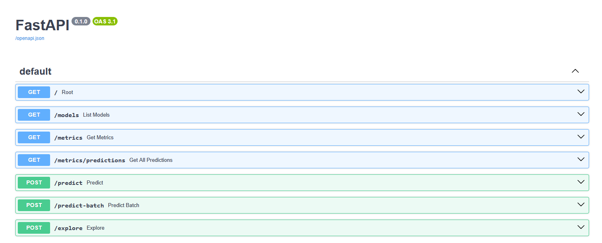

## *Processus de déploiement de l'API*

### Introduction

Pour le deploiement de mon modèle, j'ai utilisé la plateforme de cloud de Google (Google Cloud Service, GCS) qui offre une infrastructure robuste et scalable pour héberger des applications et des services. Mon choix s'est arrêté sur GCS principalement parce que c'est la plateforme que nous avons utilisé durant la formation mais il en existe plusieurs autres plateformes similaires, comme Amazon Web Services (AWS) ou Microsoft Azure, qui sont similaires et qui offrent des fonctionnalités comparables. 

 

GCS est particulièrement apprécié pour son intégration avec d'autres services de Google, et son tierce gratuit qui permet de tester et de déployer des applications sans frais initiaux. De plus, GCS est reconnu pour sa fiabilité, sa sécurité et sa facilité d'utilisation, ainsi que pour les nombreux services qu'elle propose pour le déploiement de modèles de machine learning.

 

### Processus de déploiement de l'API de classification de plantes

#### **Architecture de l'application**
Avant de pouvoir déployer mon modèle, j'ai dû créer une architecture qui permet de faire une image Docker de mon application. J'ai utilisé FastAPI, un micro-framework web en Python, pour créer une API RESTful qui reçoit des images de plantes, les traite et retourne les prédictions des modèles. J'ai ensuite créé un fichier Dockerfile qui définit l'environnement nécessaire pour exécuter mon application, y compris l'installation de Python, des bibliothèques nécessaires et la copie de mon code source. Pour aussi éviter tout soucis avec des connections internets de mauvaises qualités et pour anticiper la fin de mon abonnement gratuit à la plateforme de Weights & Biases, j'ai inclut les modèles de classification de plantes dans l'image Docker pour qu'il soit disponible localement lors de l'exécution de l'application.

 

#### **Génération de l'image docker et tests locaux**

Avant de construire l'image Docker et de la pousser vers le registre de conteneurs, j'ai testé mon application localement pour m'assurer qu'elle fonctionne correctement. J'ai lancé localement mon backend et j'ai vérifié que toutes les routes fonctionnaient comme prévu en utilisant l'interface de FastAPI pour faire les tests des différents endpoints. Ensuite, j'ai lancé mon frontend localement aussi pour vérifier que l'interface utilisateur était fonctionnelle et que les interactions avec le backend se déroulaient sans problème. J'ai également vérifié que les prédictions du modèle étaient correctes en testant avec différentes images de plantes.

 

#### **Deploiement de l'image docker sur Google Artifact Registry**

Une fois tous ces tests locaux réussis, j'ai pu construire l'image Docker de mon application. J'ai tout d'abord fait des tests locaux de mon image Docker pour m'assurer que tout fonctionnait correctement dans l'environnement conteneurisé avant de la pousser vers le registre de conteneurs de Google. J'ai utilisé la commande `docker build` pour construire l'image Docker et j'ai vérifié que l'application fonctionnait correctement en exécutant un conteneur localement à partir de cette image. Une fois que j'étais satisfait du fonctionnement de l'image Docker, j'ai utilisé la commande `docker push` pour pousser cette image vers le registre de conteneurs de Google (Google Artifact Registry, GAR) afin de pouvoir la déployer sur GCS.

 

#### **Déploiement de l'application sur Google Cloud Run**

Finalement, une fois que l'image était sur Artifact Registry, j'ai utilisé Google Cloud Run, un service de compute sans serveur qui permet de déployer des applications conteneurisées, pour déployer mon application sur GCS. J'ai configuré Cloud Run pour utiliser l'image Docker que j'avais poussée vers Artifact Registry, et j'ai défini les paramètres de déploiement tels que la région, les ressources allouées et les autorisations d'accès. Une fois le déploiement terminé, mon application était accessible via une URL publique fournie par Cloud Run, ce qui permet à n'importe qui de faire des requêtes à l'API pour obtenir des prédictions de classification de plantes. L'idée était ici de faire en sorte que le frontend puisse communiquer avec le backend de manière fluide et transparente, en utilisant l'URL publique fournie par Cloud Run pour faire les requêtes à l'API et obtenir les résultats de classification de plantes.

Voici une vue d'ensemble des différentes API qui sont disponoble via cette URL publique, et qui permettent de faire des prédictions de classification de plantes à partir d'images :

##### Figure 1 : Vue d'ensemble des différentes routes de l'API de classification de plantes, qui sont disponibles via l'URL publique fournie par Cloud Run. Ces routes permettent de faire des prédictions de classification de plantes à partir d'images, en utilisant les différents modèles de classification de plantes que j'ai entrainé et déployé sur GCS. Les utilisateurs peuvent faire des requêtes à ces routes pour obtenir des prédictions précises et rapides pour leurs images de plantes, ce qui rend l'application accessible et utile pour un large public.

J'ai mis en place 3 types d'API : 

- Une première API qui permet d'obtenir plus d'informatin sur les modèles utilisés pour la classification de plantes, y compris les différentes classes de plantes que chaque modèle peut identifier.
- une classe d'API de classification de plantes à partir d'images, qui permet aux utilisateurs de faire des prédictions de classification de plantes en envoyant des images à l'API soit seul (/predict) ou en batch (/predict-batch) pour faire des prédictions sur plusieurs images à la fois.
- une classe d'API de monitoring, qui permet de suivre les performances du modèle en production en enregistrant les différentes prédictions faites par le modèle, ainsi que les différentes métriques de performance (surtout au niveau de la précision et de la confiance) pour chaque classe. 

Les données de prédictions sont enregistrées en temps réel sur l'application Weight and Biases, mais j'ai aussi mis en place un système de monitoring en temps réel sur le frontend, qui permet à l'utilisateur de suivre les performances du modèle en production. Il existe 2 API distincts pour obternir les données de monitoring : une API qui permet d'obtenir les données de monitoring pour les 20 dernières predictions (/metrics), et une API qui permet d'obtenir toutes les données de prediction en un seul appel (/metrics/predictions) pour pouvoir les exporter avec facilité.

   

Les différentes API sont disponibles à l'adresse suivante : 

## [Plant detect API](https://plantdetectapi-2a5a6b4c0e-uc.a.run.app/).