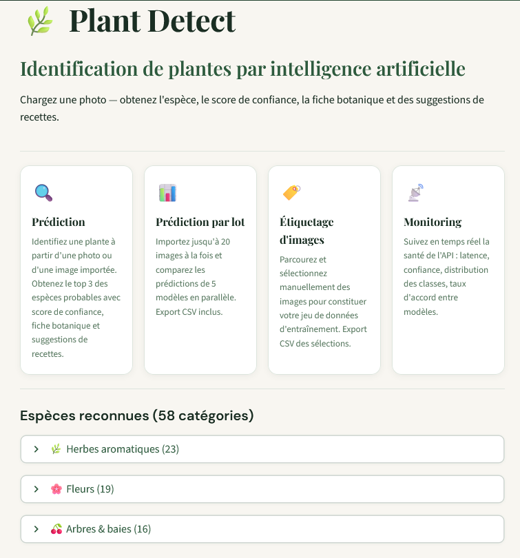
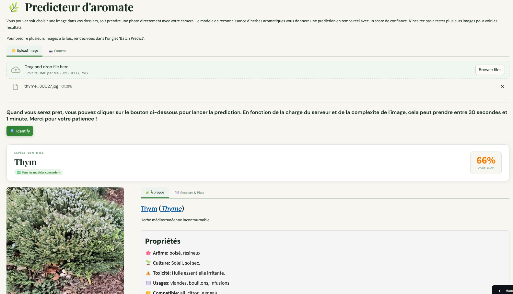
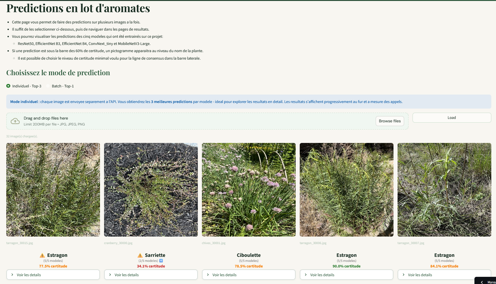
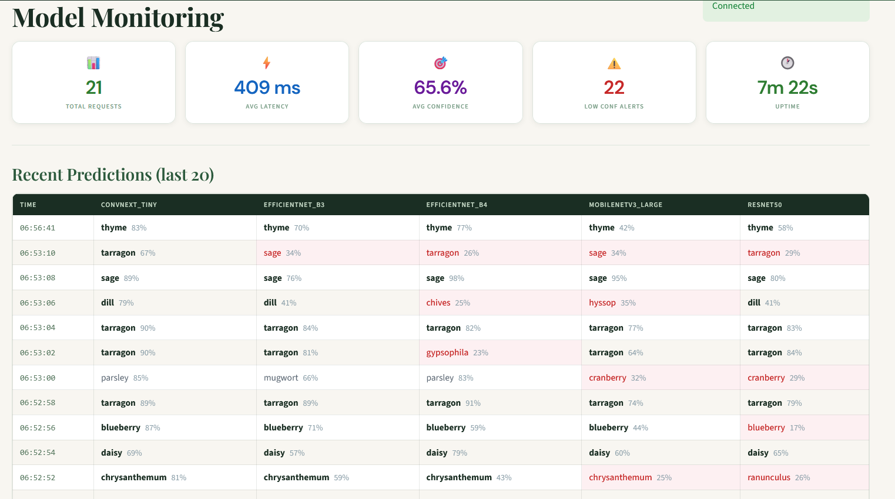

# Génération d'une interface utilisateur pour l'utilisation des modèles de classification de plantes

🎯 Objectif du module

L'objectif de ce module est de déployer les modèles de classification de plantes que j'ai entrainé dans les étapes précédentes, pour permettre une utilisation facile et intuitive des modèles par des personnes qui n'ont aucune connaissance technique. Pour ce faire, j'ai choisi d'utiliser Streamlit, une bibliothèque Python qui permet de créer des applications web interactives de manière simple et rapide. Streamlit est particulièrement adapté pour les projets de machine learning, car il offre une intégration facile avec les bibliothèques de data science et de machine learning en Python, ainsi que des fonctionnalités pour afficher des graphiques, des images et des widgets interactifs. En utilisant Streamlit, j'ai pu créer une interface utilisateur qui permet aux utilisateurs de télécharger des images de plantes, de faire des prédictions avec les modèles de classification de plantes, et d'afficher les résultats de manière claire et intuitive. Cette interface utilisateur rend les modèles de classification de plantes accessibles à un large public, et permet à chacun de bénéficier des résultats de mon travail de manière simple et efficace.

## Processus de création de l'interface utilisateur

La première étape a été de configuer mon répertoire pour permettre le développment de mon frontend de façon efficace et professionnelle. Pour ce faire, j'ai isolé tout mon code de frontend dans un répertoire dédié, ce qui m'a permis de mieux organiser mon projet et de faciliter le développement de l'interface utilisateur. L'application Streamlit permet d'avoir plusieurs pages indépendantes et une navigation fluide entre elles avec un système de navigation intégré mais pour ce faire, il faut créer un fichier "pages" contenant le script pour les différentes pages de l'application (Script python et le nom des pages est utilisé par Streamlit pour les afficher dans le navigateur). On doit également créer un fichier "main.py" qui sert de point d'entrée pour l'application Streamlit, et qui contient le code pour la page d'accueil de l'application. Finalement, pour que l'application fonctionne bien, il est impératif de créer un fichier "requirements.txt" pour spécifier les dépendances nécessaires pour exécuter l'application Streamlit.

J'ai voulu garder l'application le plus simple possible. La page d'acceuil détail les différentes fonctionnalité de l'application et explique comment utiliser l'application pour faire la classification d'images de plantes. La deuxième page de l'application permet à l'utilisateur de soit télécharger une image de plante, soit de prendre une image avec la caméra de son téléphone. Une fois cette image téléchargée, l'utilisateur peut faire une prédiction avec les modèles de classification de plantes, et afficher les résultats de manière claire et intuitive. Même si les résultats des tests de performances des différents modèles de classification montre que le modèle le plus performant est le modèle Convnext_tiny, j'ai quand même décidé d'inclure les autres modèles à titre comparatif pour l'utilisateur un peu plus curieux et intéressé par les détails techniques de l'application et surtout des performances de chacun de ces modèles. Je suis conscient que cette architecture peut porter à confusion pour les utilisateurs qui ne sont pas familiers avec les modèles de machine learning, mais j'ai voulu offrir une expérience utilisateur complète et transparente en montrant les résultats de tous les modèles de classification de plantes que j'ai entrainé, même si certains d'entre eux sont moins performants que d'autres. De plus, cela permet à l'utilisateur de mieux comprendre les différences entre les différents modèles de classification de plantes, et de faire un choix éclairé en fonction de ses besoins et de ses préférences. 

 

Voici un example de chacune des pages de l'application Streamlit que j'ai développée pour la classification d'images de plantes: 

 

##### Figure 1 : Page d'acceuil de l'application Streamlit pour la classification d'images de plantes. cette page détaille les différentes fonctionnalités de l'application et explique comment utiliser l'application pour faire la classification d'images de plantes.

  

##### Figure 2 : Page de l'application Streamlit pour faire une prédiction de classification de plantes à partir d'une image téléchargée ou prise avec la caméra du téléphone. L'utilisateur peut faire une prédiction avec les modèles de classification de plantes, et afficher les résultats de manière claire et intuitive. Lorsque la plante est identifiée, on appercois une fiche descriptive de cette plante avec quelques conseils de culture et si la plante est commestible, il y a même des sugegstions de recettes. Finallement, pour les utilisateurs plus curieux, il est possible de visualiser les différentes classes de plantes que le modèle a identifié, ainsi que les différentes probabilités associées à chaque classe.

  

##### Figure 3 : Page de l'application Streamlit pour faire des prédictions de classification de plantes en batch à partir de plusieurs images téléchargées. L'utilisateur peut faire des prédictions avec les modèles de classification de plantes soit en envoyant les images une par une, soit en les envoyant toutes en même temps (elles seront traitées par batch de 20 par le backend pour permettre un affichage plus rapide des résultats. La page sera rafraichie à chaque fois que les résultats du prochain batch de 20 images sont disponibles).

  

##### Figure 4 : Page de l'application Streamlit pour le monitoring en temps réel des performances du modèle de classification de plantes en production. Cette page permet à l'utilisateur de suivre les différentes prédictions faites par le modèle, ainsi que les différentes métriques de performance (surtout au niveau de la précision et de la confiance) pour chaque classe, en affichant ces informations de manière claire et intuitive pour permettre à l'utilisateur de mieux comprendre les performances du modèle en production.

### Conclusion

En conclusion, la création d'une interface utilisateur avec Streamlit pour la classification d'images de plantes a été une étape cruciale pour rendre les modèles de classification de plantes accessibles à un large public. En utilisant Streamlit, j'ai pu créer une application web interactive qui permet aux utilisateurs de télécharger des images de plantes, de faire des prédictions avec les modèles de classification de plantes, et d'afficher les résultats de manière claire et intuitive. Cette interface utilisateur offre une expérience agréable et facile à utiliser pour faire la classification d'images de plantes, et permet à chacun de bénéficier des résultats de mon travail de manière simple et efficace.

   

---
Il est possible d'accéder à l'application de classification de plantes que j'ai développée en utilisant Streamlit en cliquant sur le lien suivant : 

## [Plant detect application](https://plantpredict.streamlit.app/). 