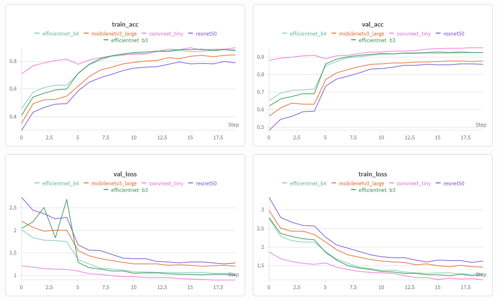

## Étape 1 — Entrainement des modèles de classification de plantes

### 🎯 *Objectif de l'étape*

Dans cette première étape, le but était d'entrainer différents modèles de classification de plantes à partir des images collectées. Pour ce faire, je suis parti de modèles pré-entrainés sur ImageNet, tels que EfficientNet-B3/B4, ResNet-50, MobileNetV3-Large et ConvNeXt-Tiny, que j'ai adapté à mon dataset de plantes. L'entrainement c'est fait en deux étapes:

1) J'ai d'abord entrainé la queue de ces modèles (la partie de classification) en gardant la tête (la partie de convolution) gelée. Cela permet de profiter des caractéristiques visuelles déjà apprises par ces modèles sur ImageNet, tout en adaptant la partie de classification à mon dataset de plantes.

2) Ensuite, j'ai effectué un fine-tuning de l'ensemble du modèle (tête + queue) pour permettre au modèle d'ajuster ses caractéristiques visuelles aux spécificités de mon dataset de plantes.

J'ai utilisé la bibliothèque PyTorch pour implémenter et entrainer mes modèles, en utilisant des optimisateurs tels que Adam et des fonctions de perte adaptées à la classification multi-classe (comme CrossEntropyLoss). J'ai monitoré les différentes métriques d’entrainement, telles que la précision et la perte pour évaluer les performances des modèles. Les mêmes conditions ont été appliquées à tous les modèles pour assurer une comparaison équitable.

Petit rappel, voici les modèles que j,ai utilisé pour cette étape d'entrainement avec leurs caractéristiques principales:

### EfficientNet‑B3 / B4
- **Backbone** : MBConv + Squeeze‑and‑Excitation  
- **Forces** : efficacité, précision, faible coût  
- **Entrée** : B3 → 300×300, B4 → 380×380  
- **Embedding** : 1536 (B3), 1792 (B4)  
- **Usage idéal** : classification multi‑classe haute précision  

### ResNet‑50
- **Backbone** : blocs bottleneck + résidual connections  
- **Forces** : stabilité, généralisation  
- **Entrée** : 224×224  
- **Embedding** : 2048  
- **Usage idéal** : baseline robuste, facile à fine‑tuner  

### ConvNeXt‑Tiny
- **Backbone** : convolution large kernel (7×7), LayerNorm  
- **Forces** : performance proche des Transformers  
- **Entrée** : 224×224  
- **Embedding** : 768  
- **Usage idéal** : textures complexes, datasets variés  

### MobileNetV3‑Large
- **Backbone** : depthwise separable + SE + h‑swish  
- **Forces** : ultra‑léger, très rapide  
- **Entrée** : 224×224  
- **Embedding** : 1280  
- **Usage idéal** : mobile / edge computing  

## Préparation des données et entrainement

Pour un bon entrainement, il est important de préparer les données de manière adéquate. J'ai utilisé des techniques d'augmentation de données (changement de couleur, rotation, mise à l'échelle par example) pour augmenter la diversité de mon dataset et ainsi éviter au maximum le surapprentissage. J'ai également utilisé une validation croisée pour évaluer les performances de mes modèles pendant l'entrainement (les données initiales ont été séparées en jeu d'entrainement et jeu de validation, à une proportion de 80/20 et en gardant les proportions de chaque classe). Finalement, pour combler l'imbalance qu'il y avait entre les différentes classes, j'ai utilisé une technique de matrice de poids pour les classes minoritaires et majoritairesafin pour équilibrer lors du calcul de la perte et permettre au modèle d'apprendre de manière plus efficace à partir de toutes les classes.

## Résults

Au cours de l'entrainement, j'ai monitoré les différentes métriques d’entrainement, telles que la précision et la perte, à l'aide d'outils de monitoring disponible en ligne (discuter plsu en détail dans la section suivante). J'ai également utilisé des techniques de visualisation pour mieux comprendre les performances de mes modèles, comme les courbes d'apprentissage et les matrices de confusion. Comme l'apprentissage est une tâche gourmande en ressources, j'ai utilisé les GPU disponibles sur Google Colab pour accélérer le processus d'entrainement et réduire le temps nécessaire pour obtenir des résultats significatifs.

Comme discuté dans l'introduction, j,ai utilisé la technique de trnasfert learning pour adapter les modèles pré-entrainés à mon dataset de plantes. Cette technique m'a permis de bénéficier des caractéristiques visuelles déjà apprises par ces modèles sur ImageNet, tout en adaptant la partie de classification à mon dataset de plantes. J'ai également utilisé le fine-tuning pour permettre au modèle d'ajuster ses caractéristiques visuelles aux spécificités de mon dataset de plantes, ce qui a permis d'améliorer les performances de mes modèles. L'entrianement a donc été divisé en deux étapes: 

- D'abord entrainer la queue du modèle en gardant la tête gelée pour 5 epochs, 
- Suivi d'un fine-tuning de l'ensemble du modèle (tête + queue) avec un taux d'apprentissage réduit pour permettre au modèle d'ajuster ses caractéristiques visuelles aux spécificités de mon dataset de plantes sans perdre les connaissances acquises pour 15 epochs.

##### Figure 1 : Courbes d'apprentissage de la précision et de la perte pour les modèles entrainés. On observe que les modèles convergent vers une précision élevée et une perte faible au fil des epochs, avec quelques variations entre les modèles.

  

Voici les résultats finaux de l'entrainement des différents modèles de classification de plantes, en termes de précision :

| Modèle              | Best Val Accuracy | Checkpoint                  |
|---------------------|------------------:|-----------------------------|
| **convnext_tiny**      | **0.95399**        | `convnext_tiny_best.pth`      |
| **efficientnet_b3**    | 0.92878            | `efficientnet_b3_best.pth`    |
| **efficientnet_b4**    | 0.92785            | `efficientnet_b4_best.pth`    |
| **mobilenetv3_large**  | 0.87913            | `mobilenetv3_large_best.pth`  |
| **resnet50**           | 0.86224            | `resnet50_best.pth`           |

Il y a clairement un modèle qui se démarques des autres en termes de précision, c'est le modèle ConvNeXt-Tiny qui a obtenu une précision de 95.4% sur le jeu de validation, suivi de près par EfficientNet-B3 et B4 avec des précisions respectives de 92.9% et 92.8%. MobileNetV3-Large et ResNet-50 ont obtenu des précisions plus faibles, avec respectivement 87.9% et 86.2%. Ces résultats montrent que les modèles plus modernes et performants, tels que ConvNeXt-Tiny et EfficientNet-B3/B4, ont mieux réussi à s'adapter à mon dataset de plantes que les modèles plus anciens comme MobileNetV3-Large et ResNet-50. Cependant, il est important de noter que la précision n'est pas la seule métrique à prendre en compte pour évaluer les performances d'un modèle de classification, et que d'autres métriques telles que le rappel et le F1-score peuvent également fournir des informations importantes sur les performances du modèle, en particulier dans le cas de classes déséquilibrées. C'est pourquoi j'ai également monitoré ces métriques tout au long de l'entrainement pour avoir une vision plus complète des performances de mes modèles. 

Nous allons discuter plus en détail de ces différentes métriques dans la section suivante, qui est dédiée à l'évaluation des modèles de classification de plantes. 

